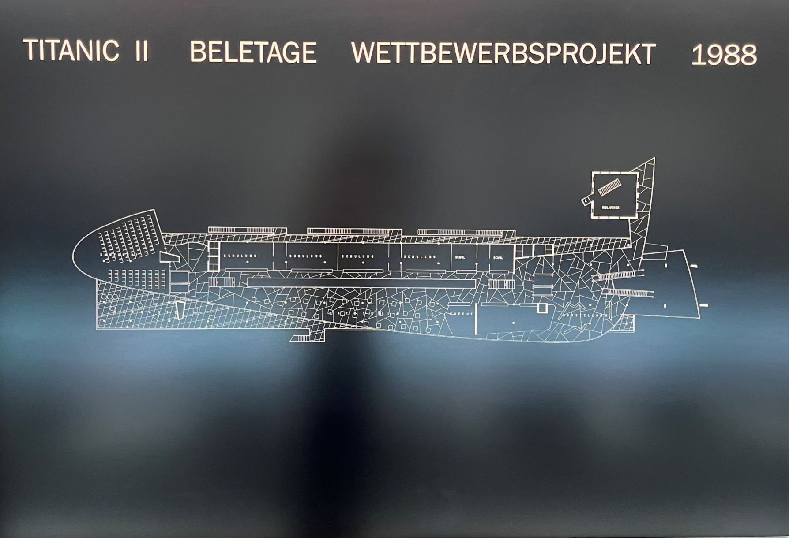

+++
title = "Die wirklich unsinkbare Titanic"
date = "2023-06-16"
draft = false
pinned = false
image = "komprimiert.2.tif"
description = "Eines der prachtvollen Gebäude der Stadt Bern, wie es entstand und was der Gedanke dahinter war."
+++
Lange Spiegel Fassaden, hohe Wände, imposante Glasscheiben und Korridore voller Kunst. Ein Schiff auf grundgelaufen inmitten von Bern. Die Schweizer Titanic.

# Titel1

text text 

